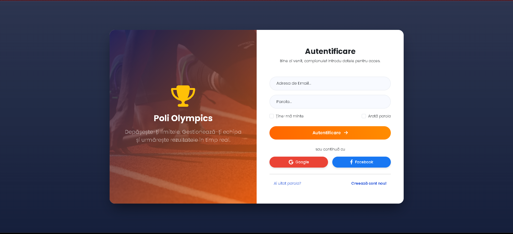
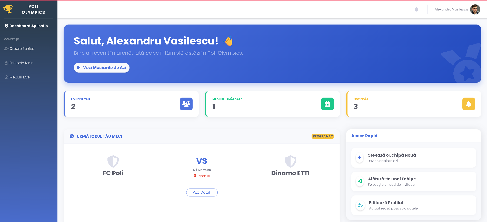
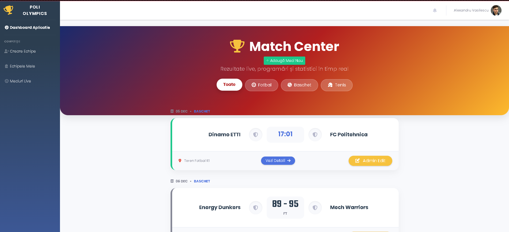
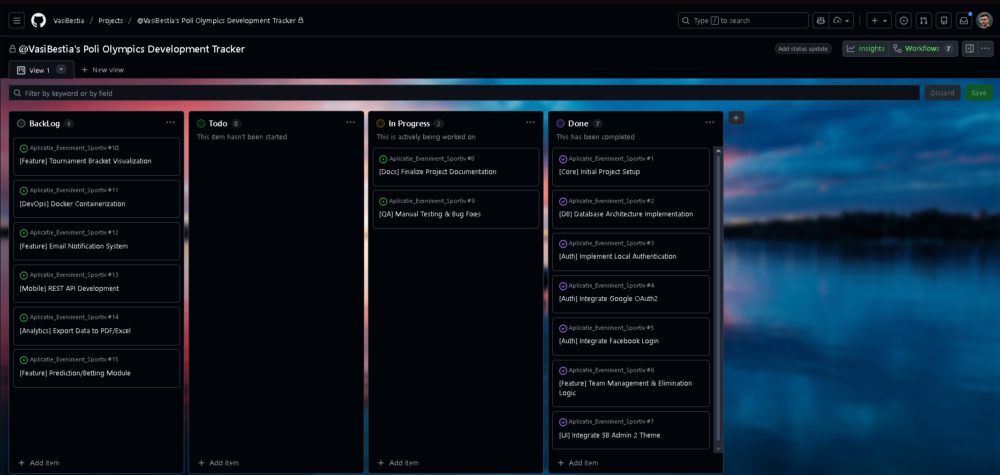

# 🏆 Sports Event Management Application

A complex web platform dedicated to organizing and managing sports tournaments, developed using **Java Spring Boot** and **Thymeleaf**. The application allows for complete administration of matches, teams, and live scores, featuring a secure authentication system via social networks.

---

## 📸 Visual Overview

### 1. Authentication System (OAuth2)
Users can quickly log in using **Google** or **Facebook** accounts, or via the standard method (username/password). The buttons are custom-styled to integrate seamlessly with the application theme.


### 2. Administrator Dashboard
The main panel offers an overview of the competition, allowing quick scheduling of new matches and visualization of team statuses.


### 3. Match Management & Team Elimination
Key functionality: The Admin can edit scores and, with a single click, **eliminate the losing team**. Eliminated teams are automatically excluded from selection lists for future matches to prevent errors.


---

### 📊 Project Management & Evolution (GitHub Projects)

For the development of **Poli Olympics**, I implemented a **Kanban-based Agile workflow** using GitHub Projects. This wasn't just a to-do list; it served as a strategic guide to transition from high-level concepts (like social authentication) to concrete, debugged features.

  
*Note: Replace 'img/github-projects-ss.png' with the actual path to your screenshot.*

#### 1. Agile Workflow Structure
I organized the development into four distinct stages to maintain a clear overview of the project's technical health:
* **Backlog (Product Roadmap):** This acted as an "Idea Incubator." I captured advanced features here—such as **Dockerization** and **Visual Tournament Brackets**—to ensure the project had a clear future trajectory without derailing the current development of core requirements.
* **To Do:** Tasks focused on finalization and technical debt, such as generating **Postman** test collections and completing the Romanian technical report.
* **In Progress:** Active development cycles. This was crucial for monitoring complex integrations like the **Facebook Login callback logic** and the **SQL-based team filtering**.
* **Done:** A verified history of completed milestones, serving as a log for every feature that passed manual and integration testing.

#### 2. Technical Refinement & Problem Solving
GitHub Projects guided my decision-making process in three specific ways:
* **Feature Decomposition:** I broke down the "Team Elimination" feature into manageable sub-tasks: (1) Database schema update, (2) Backend logic for the `is_eliminated` flag, and (3) Frontend dynamic dropdown filtering using **Thymeleaf**.
* **Priority Management:** By using **Priority Labels**, I ensured that the security infrastructure (**Spring Security + OAuth2**) was fully stable before investing time into the aesthetic styling of the **SB Admin 2** dashboard.
* **Bottleneck Identification:** Monitoring the "In Progress" column allowed me to identify when the **Facebook Meta API** configuration was taking longer than expected, signaling a need to shift focus toward debugging redirect URIs on `localhost`.

#### 3. Strategic Backlog for "Poli Olympics 2.0"
The project board helped me define a professional roadmap for future iterations, which is essential for a Bachelor's Thesis presentation. This includes transitioning the current architecture toward a **RESTful API** and implementing a **Real-time Notification System** for live score updates.

## 🚀 Key Features

### 🔐 Security & Access
* **Social Login:** Full integration with **Google OAuth2** and **Facebook Login** APIs.
* **Data Security:** Standard user passwords are encrypted using **BCrypt**.
* **Role-Based Access:** Differentiated access for Administrators (edit/delete rights) and Standard Users (view-only rights).

### ⚙️ Business Logic (Knockout Tournament)
* **Elimination System:** Implemented specific backend logic that marks teams as `is_eliminated` in the SQL Server database.
* **Smart Validation:** When scheduling a new match, the interface loads **only** active teams, preventing human error in scheduling already eliminated teams.
* **Live Updates:** Score updates are instantly reflected in the rankings/standings.

### 💻 User Interface (UI/UX)
* **Responsive Design:** Based on **Bootstrap 4** (Customized SB Admin 2 Theme).
* **Dynamic Rendering:** Pages are rendered dynamically using **Thymeleaf**.
* **Fluid Navigation:** Seamless experience navigating between matches, teams, and user profiles.

---

## 🛠️ Technology Stack

| Category | Technologies |
| :--- | :--- |
| **Backend** | Java 17, Spring Boot 3.x, Spring Security |
| **Database** | Microsoft SQL Server (JDBC, JPA/Hibernate) |
| **Frontend** | Thymeleaf, HTML5, CSS3, JavaScript, Bootstrap 4 |
| **Build Tool** | Maven |
| **External APIs** | Google Identity Platform, Meta for Developers (Facebook Login) |

---

## 💻 Installation and Local Setup

1.  **Clone the repository:**
    ```bash
    git clone [https://github.com/your-username/Project-Name.git](https://github.com/your-username/Project-Name.git)
    ```

2.  **Database Configuration:**
    * Ensure you have SQL Server installed and running.
    * Create a database named `Eveniment_Sportiv`.
    * Configure `src/main/resources/application.properties` with your username and password.

3.  **Environment Variables Configuration (.env):**
    * For Facebook and Google login to work, create a `.env` file in the root directory or set the variables in your IDE:
    ```properties
    GOOGLE_CLIENT_ID=your_key_here
    GOOGLE_CLIENT_SECRET=your_secret_here
    FACEBOOK_CLIENT_ID=facebook_app_id
    FACEBOOK_CLIENT_SECRET=facebook_app_secret
    ```

4.  **Running the Application:**
    * Run the `EvenimentSportivApplication.java` class from IntelliJ/Eclipse.
    * Access the app at: `http://localhost:8080`.

---

## 👤 Author

Project realized and developed entirely by Vasilescu Alexandru Gabriel.

This project was developed as part of a bachelor's thesis, aiming to digitize the process of organizing sports competitions.

---

## 📄 License

All rights reserved © 2024 Vasilescu Alexandru Gabriel.
The source code is available for viewing for educational purposes.
